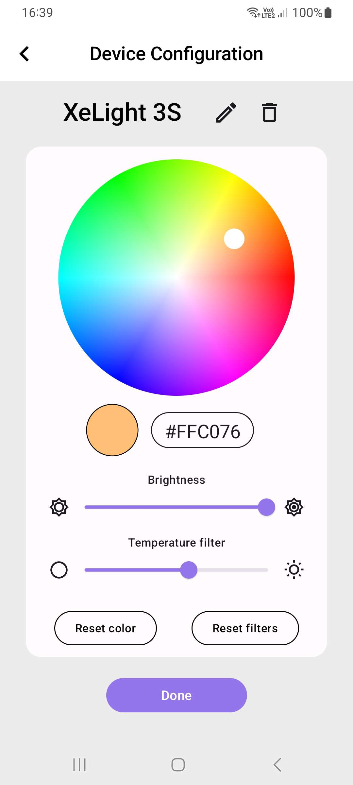

# ITU-Projekt-ZenGlow

### Autory

- **Jakub Brnák** - <xbrnak01@stud.fit.vutbr.cz>
- **Nikolas Nosál** - <xnosal01@stud.fit.vutbr.cz>
- **Daniel Blaško** - TODO

### Úvod 

Aplikácia pre jednoduché a intuitívne ovládanie domáceho a záhradného osvetlenia, ktorá vníma náladu a aktuálnu situáciu používateľa a na základe týchto informácií umožňuje nastaviť ideálne osvetlenie pre dané prostredie, v ktorom sa užívateľ pohybuje. Aplikácia je vyvíjaná v prostredí Android Studio, v jazyku Kotlin s použitím frameworku Jetpack Compose. Bol použitý dizajnový jazyk Material Design 3.

### Spustenie aplikácie

Pre spustenie aplikácie je potrebné otvoriť priložený projekt vo vývojovom prostredí Android Studio(pri vývoji bola použitá verzia Hedgehog). Pri inicializácií projektu prostredie automaticky stiahne a integruje moduly potrebné pre emuláciu systému android a spustenie aplikácie. Prostredie Android Studio takisto uomžňuje aplikáciu nahrať do vášho fyzického zariadenia so systémom Android pripojením cez USB. Je však pred tým potrebné túto možnosť na zariadení povoliť (Allow USB debugging) a následne po úspešnom pripojení v Android Studio zvoliť vaše zariadenie v zozname dostupných zariadení pre testovanie.

### Dokuemntácia
- Popis návrhu aplikácie - [Návrh-Aplikácie](docs/návrh-aplikácie.pdf)
- (Jakub Brnák) implementácia - [Technická-Správa-xbrank01](docs/technická-správa-xbrnak01.pdf)
- (Nikolas Nosál) implementácia - [Technická-Správa-xnosal01](docs/technická-správa-xnosal01.pdf) 
- (Daniel Blaško) implementácia - TODO

### Ukážky
| Main-Screen                      | Device-Config                        | Mood-Boost                            |
| :------------------------------: | :----------------------------------: | :-----------------------------------: |
|  |  |  |

### Použité knižnice tretích strán a multimediálne zdroje

**[Komponenty color pickeru](https://github.com/skydoves/colorpicker-compose)**
 - Autor: [Jaewoong Eum](https://github.com/skydoves)  
 - Licencia: [Apache License 2.0](https://github.com/skydoves/colorpicker-compose/blob/main/LICENSE)

**[Použité obrázky](https://www.pexels.com/sk-sk/)**   
 - Licencia: [Creative Commons Zero (CC0)](https://www.pexels.com/sk-sk/license/)
